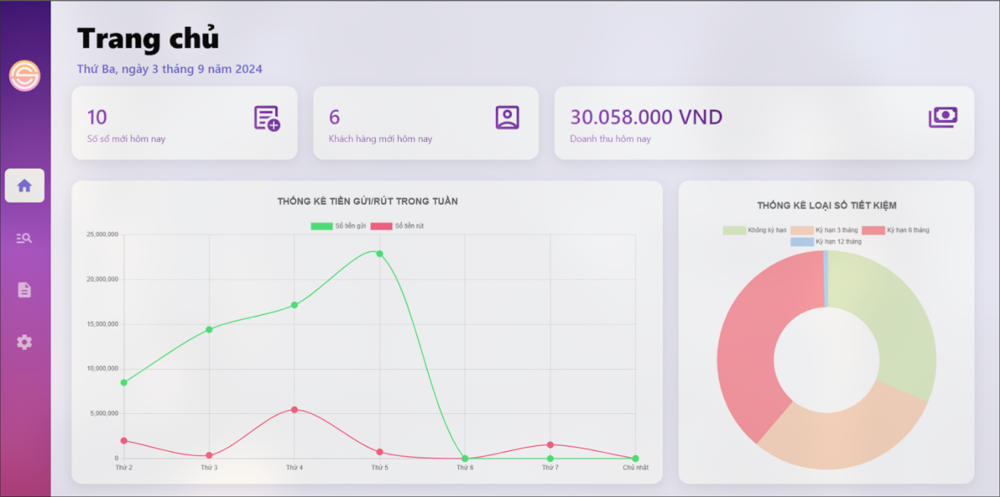

<a id="readme-top"></a>
<div align = "center">

[![Contributors][contributors-shield]][contributors-url]
[![Stargazers][stars-shield]][stars-url]
[![Issues][issues-shield]][issues-url]
</div>

<br />
<div align="center">
  <a href="https://github.com/DenverNg/CSC13002_Intro-to-SE">
    
  </a>

  <h1 align="center">SE Bank - Saving for Earning Bank</h1>
  <p align="center">
    A project for our CSC13002 - Introduction to Software Engineering course in HCMUS. We hope that anyone who needs to find resources for their project can find this repository helpful.
  </p>
</div>
<p align="center">
  
</p>

<!-- TABLE OF CONTENTS -->
<details>
  <summary>Table of Contents</summary>

- [1. About the project](#1-about-the-project)
- [2. Getting Started](#2-getting-started)
  - [Prerequisites](#prerequisites)
  - [Installation](#installation)
- [3. Documentation](#3-documentation)
  - [Folder Structure:](#folder-structure)
  - [Express Setup:](#express-setup)
  - [Troubleshooting:](#troubleshooting)
- [4. Project Analysis:](#4-project-analysis)
  - [Project Proposal:](#project-proposal)
  - [Software Design:](#software-design)
  - [Technologies Stack:](#technologies-stack)
  - [Implementation and Testing:](#implementation-and-testing)
  - [Deployment and Maintenance](#deployment-and-maintenance)
- [5. Demo](#5-demo)
  - [Dashboard:](#dashboard)
  - [Sidebar:](#sidebar)
  - [Transactions:](#transactions)
  - [Report:](#report)
  - [Setting:](#setting)
- [6. Acknowledgments](#6-acknowledgments)
</details>

## 1. About the project 

This project is part of the CSC13002 - Introduction to Software Engineering course. This management software is designed to provide a user-friendly interface and streamline business operations for SE - Saving for Earning Bank, improving efficiency and service quality. The system allows bank staff to manage savings accounts, including creating accounts, updating balances, calculating interest, and generating reports. The software supports the management of both term and non-term savings, automates interest calculations, and ensures secure data handling within the bank's database, accessible without requiring user login.

<p align="right">(<a href="#readme-top">back to top</a>)</p>

## 2. Getting Started

### Prerequisites
To run the web application locally, follow these steps:
1. **Install application**:
Make sure you have Node.js, Docker and DBeaver to run this project:
  - DBeaver: https://dbeaver.io/download/
  - Docker: https://docs.docker.com/desktop/install/windows-install/
  - Nodejs: https://nodejs.org/en/download/package-manager

### Installation
1. **Clone the Repository**:
   ```bash
   git clone https://github.com/DenverNg/CSC13002_Intro-to-SE.git
    ```
2. **Create MYSQL image in docker**:
- Move to QLSTK/docker or you can run these command:
    ```bash
    cd QLSTK/docker
    docker compose -f mysql.yml -p nodejs-sql up -d
    ```
  - `-f`: file name
  - `-p`: project name
  - `-d`: detach, run as background
- Create connection in DBeaver: Make sure you have enough driver or packages to run DBeaver (download if needed). Then, you can config DBeaver with these information:
  - *Server host:* `localhost`
  - *Port:* `3307`
  - *User name:* `root`
  - *Password:* `123456`

3. **Install packages**"
Run these command to install packages for this project:
```bash
npm i ejs
npm i --save-exact express
npm i --save-exact mysql2
npm i --save-dev nodemon
```

4. **Run docker**:
Open docker and make sure your packages is running.

5. **Run the Application**:
You can start the application using:
```bash
cd QLSTK
npm run dev
```
The application will be available at `http://localhost:3307`

**Note:** After install all application and dependencies, if you want to run the application next time, just run step 4 and 5.

<p align="right">(<a href="#readme-top">back to top</a>)</p>

## 3. Documentation
### Folder Structure:
The project is organized into the following structure:

```
└── 📁CSC13002_Intro-to-SE                                      
    └── 📁Dataset                                               # Folder store Python script to generate data for SEBANK_DATA.sql
        └── name.json                                           # Vietnamese name data
    └── 📁QLSTK
        └── 📁docker
            └── mysql.yml                                       # Source for config docker
        └── 📁src
            └── 📁config                                        # Config folder
            └── 📁controllers                                   # Controllers folder
                └── homeControllers.js                          # Main file to maintain GET, POST method
            └── 📁public                                        # Static assets (CSS, JS, images)
                └── 📁css
                └── 📁images
                └── 📁js
            └── 📁routes                                        # Express routes
                └── web.js                                      # Main route file
            └── 📁services                                      # Connection folder 
                └── CRUD.js                                     # Main file to call BE querry
            └── 📁views                                         # EJS templates
            └── qlstk.js                                        # Main application file
        └── .env                                                # Config DBeaver
        └── .gitignore                                          # Git ignore file
        └── package-lock.json                                   # Project metadata and scripts
        └── package.json                                        # Project metadata and scripts
    └── 📁Template
        └── Script-demo.docx                                    # Script for my presentation
        └── Template#0-ProjectProposal-2022.pdf                 # Project proposal template
        └── Template#1-PhanTich-2019.pdf                        # Project analysis template
        └── Template#2-ThietKe.pdf                              # Project design template
        └── Template#3-KiemThu.pdf                              # Project testing template
    └── README.md                                               # Project documentation (this file)
    └── SEBANK_DATA.sql                                         # Data for application
    └── SEBANK_MYSQL.sql                                        # MySQL file for application

```

### Express Setup:
The backend is powered by Express.js, a minimal and flexible Node.js web application framework. Express handles routing, middleware, and rendering EJS templates.

Key files include:
- `qlstk.js`: The main entry point of the application.
- `routes/` Contains all route definitions for the application.
- `views/`: Contains EJS templates used for rendering HTML pages.

### Troubleshooting:
Common Issues:
- Ensure all dependencies are installed by running `npm install`.
- Verify that SQL Server and Docker are running and accessible.

<p align="right">(<a href="#readme-top">back to top</a>)</p>

## 4. Project Analysis:
### Project Proposal:
Key requirements include:
- Creation of new savings accounts with customer information and initial deposit.
- Support for both term and non-term savings accounts, with interest calculations based on predefined rules.
- Automation of balance updates, account closure when fully withdrawn, and report generation.
- Secure and efficient data handling, with administrative controls for modifying terms and conditions.
### Software Design:
The system is designed using the MVC (Model-View-Controller) architectural pattern, ensuring a clear separation between data management (Model), user interface (View), and business logic (Controller). The software also implements object-oriented programming principles with specific classes for savings accounts, customers, transactions, and settings.
Key components: 

- **View:** User interface for interacting with the system, including forms, tables, and reports.
- **Controller:** Manages user requests, processes business logic, and updates the Model.
- **Model:** Manages the data and logic for the application, ensuring data integrity and consistency.
  
### Technologies Stack:
The project utilizes a combination of technologies and tools to build a robust and maintainable web application:
- **Frontend:** HTML, CSS, and JavaScript for structuring content, styling, and interactivity.
- **Libraries:** Chart.js for creating interactive charts and visualizations.
- **Backend:** Node.js and Express.js for server-side logic and routing.
- **Database:** SQL Server for data storage, selected for its ease of use, high performance, and strong community support.
- **Version Control:** Git and GitHub for source code management and collaboration.
- **UI/UX Design:** Figma for designing the user interface.

The application is built to be compatible with multiple operating systems, including Windows, Linux, and macOS, and is designed to run efficiently on both desktop and server environments.

### Implementation and Testing:
The project follows a structured development process, starting with requirement analysis, followed by high-level and detailed design, implementation, and testing. The implementation phase includes coding the software according to the design specifications and setting up the database. Testing involves creating a test plan, developing test cases, and validating the software against the requirements.

### Deployment and Maintenance
After the software is tested and validated, it will be deployed to the production environment. The deployment process includes installing the software on the target systems, configuring it, and training the users. Post-deployment, the software will be maintained with regular updates, bug fixes, and potential feature enhancements based on user feedback.

<p align="right">(<a href="#readme-top">back to top</a>)</p>

## 5. Demo
This section provides an overview of the main user interface components of the **SE - Saving for Earning Bank management system**. The following subsections describe the **Dashboard**, **Sidebar**, **Transaction UI**, **Report** and **Setting** along with their key features.
### Dashboard:
The default page when accessing the website is the Dashboard – “Home” page.
<div align="center">
    
</div>

- This page provides data on the number of new accounts, new customers, and daily revenue. 
- It also displays figures for weekly withdrawals and deposits in a line chart, making it easy to observe the trends in withdrawals/deposits for the current week. 
- Additionally, the number of accounts for each term type is shown in a pie chart to facilitate management and to identify which term type is the most popular and widely chosen.

### Sidebar:
The menu bar expands when the mouse hovers over it and collapses when the mouse moves away. The currently active page is highlighted on the menu bar.
### Transactions:
<div align="center">
    
</div>

- Functions for **opening savings accounts**, **creating deposit slips**, and **creating withdrawal slips** are located at the bottom of the table.
- Additionally, our team has added a search function that allows users to find accounts by ID card number, customer name, or account number, making it easier to locate accounts when the customer only remembers one of these details.

### Report:
- The "Reports" page displays the Daily Activity Revenue Report, defaulting to the `current date`.
<div align="center">
    
</div>

- And the Monthly Account Opening/Closing Report, defaulting to the Savings Type: `No Term` and the `Current Month`. 
<div align="center">
    
</div>

- Additionally, our team has implemented functionalities for downloading the report in Excel format and printing the report.

### Setting: 
- Due to modifications and changes in regulations that significantly impact account management, regular employees are not permitted to make edits; only senior staff, such as the CEO, are allowed to make changes. 
- To be able to edit, the CEO will be provided with a password to access the Settings page. If the password is entered incorrectly more than three times, the account will be locked for 15 seconds.
  <div align="center">
    
</div>
- After entering the correct password, the user will be directed to the main settings interface. The settings interface is divided into two tables:
  <div align="center">
    
</div>

- **Table 1: Changes in Term Types:**
  - *Adding or Removing Term Types*: This involves adding new term types or removing existing ones.
  - *Editing Interest Rates*: This includes modifying the interest rates for each term type.
- **Table 2: Changes in Minimum Quantities**
  - *Minimum Deposit Time:* This specifies the minimum duration required for the deposit.
  - *Minimum Deposit Amount:* This indicates the smallest amount that can be deposited.
<p align="right">(<a href="#readme-top">back to top</a>)</p>

## 6. Acknowledgments
- [ChatGPT](https://chatgpt.com)
- [Best-README-Template](https://github.com/othneildrew/Best-README-Template?tab=readme-ov-file)
- [Vietnamese-namedb ](https://github.com/duyet/vietnamese-namedb)
<p align="right">(<a href="#readme-top">back to top</a>)</p>

[contributors-shield]: https://img.shields.io/github/contributors/DenverNg/CSC13002_Intro-to-SE.svg?style=for-the-badge
[contributors-url]: https://github.com/DenverNg/CSC13002_Intro-to-SE/graphs/contributors
[stars-shield]: https://img.shields.io/github/stars/DenverNg/CSC13002_Intro-to-SE.svg?style=for-the-badge
[stars-url]: https://github.com/DenverNg/CSC13002_Intro-to-SE/stargazers
[issues-shield]: https://img.shields.io/github/issues/DenverNg/CSC13002_Intro-to-SE.svg?style=for-the-badge
[issues-url]: https://github.com/DenverNg/CSC13002_Intro-to-SE/issues